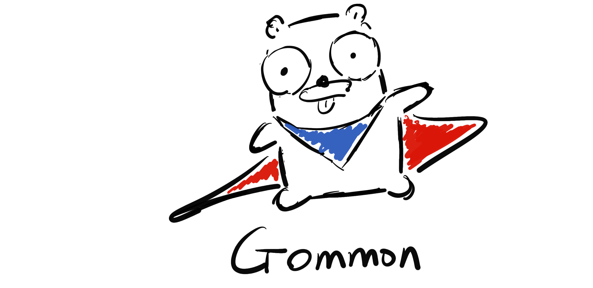

# Gommon - Go common libraries

<h1 align="center">
	 
	
	 
	 
	 
</h1>

Gommon is a collection of common util libraries written in Go.

- [errors](errors) error wrapping, inspection, multi error (error list), common error types
- [log](log) per package logger with [reasonable performance](log/_benchmarks/README.md)
- [noodle](noodle) embed static assets for web application with `.noodleignore` support
- [generator](generator) render go template, generate methods for logger interface based on `gommon.yml`
- [util](util) wrappers for standard libraries

It has little third party dependencies, only [go-yaml/yaml](https://github.com/go-yaml/yaml) in [util/cast](util/cast),
[go-shellquote](github.com/kballard/go-shellquote) in [generator](generator),
other dependencies like cobra are only for cli, see [go.mod](go.mod).

## Development

- requires go1.12+. go1.11.x should work as well, the Makefile set `GO111MODULE=on` so you can use in GOPATH
- `make help`
- [Directory layout](directory.md)

## License

MIT

## Contribution

Currently, gommon is in a very volatile state, please open issues after it becomes stable.

## About

Gommon is inspired by many existing libraries, attribution and comparision can be found in [doc/attribution](doc/attribution.md).

Gommon was part of [Ayi](https://github.com/dyweb/Ayi) and split out for wider use.
The name Gommon is suggested by [@arrowrowe](https://github.com/arrowrowe).
The original blog post can be found in dongyue web's [blog](http://blog.dongyueweb.com/ayi.html).
Thanks all the folks in [@dyweb](https://github.com/dyweb)
especially [@gaocegege](https://github.com/gaocegege) for their support in early development.