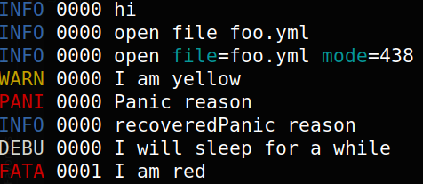

# Cli log handler

For short running cli and human read

## Usage

See [example/main.go](example/main.go)

TODO: gommon should allow sync file into markdown

````go
package main

import (
	"os"
	"time"

	dlog "github.com/dyweb/gommon/log"
	"github.com/dyweb/gommon/log/handlers/cli"
)

var logReg = dlog.NewRegistry()
var log = logReg.Logger()

func main() {
	dlog.SetHandler(cli.New(os.Stderr, true))

	if len(os.Args) > 1 {
		if os.Args[1] == "nocolor" || os.Args[1] == "no" {
			dlog.SetHandler(cli.NewNoColor(os.Stderr))
		}
	}

	log.Info("hi")
	log.Infof("open file %s", "foo.yml")
	log.InfoF("open",
		dlog.Str("file", "foo.yml"),
		dlog.Int("mode", 0666),
	)
	log.Warn("I am yellow")
	func() {
		defer func() {
			if r := recover(); r != nil {
				log.Info("recovered", r)
			}
		}()
		log.Panic("I just want to panic")
	}()
	dlog.SetLevel(dlog.DebugLevel)
	log.Debug("I will sleep for a while")
	time.Sleep(500 * time.Millisecond)
	log.Fatal("I am red")
}
````

Result in

````text
INFO 0000 hi
INFO 0000 open file foo.yml
INFO 0000 open file=foo.yml mode=438
WARN 0000 I am yellow
PANI 0000 Panic reason
INFO 0000 recoveredPanic reason
DEBU 0000 I will sleep for a while
FATA 0001 I am red
````

It has color (only tested on Linux (Ubuntu)) and can be disabled when created using no color

